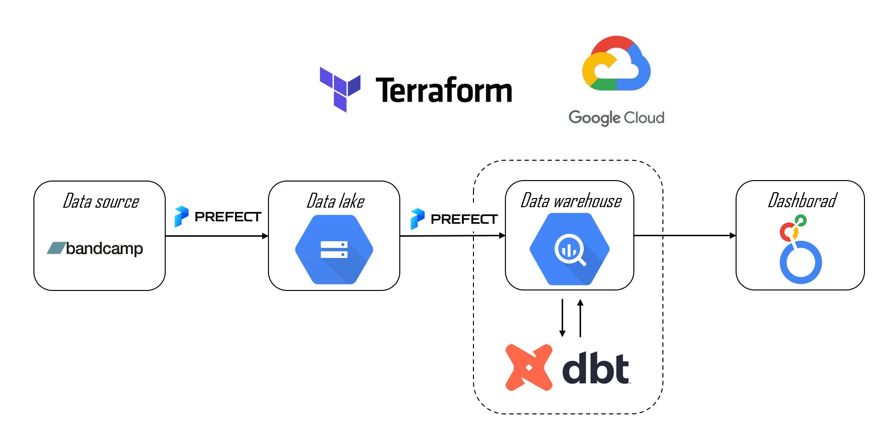

# Analysis of Bancamp sales 
This project will show you how to create a pipeline to pull posts from a website, store this data in a Bucket on Google Cloud (as my data lake), transfrom using Dbt, save this data in BigQuery (as my data warehouse), and create a basic dashboard using Google Looker

# Problem description
The goal of this project is to create a data pipeline and a dashboard that can provide insights into the sales performance of bancamp, an online music platform. The project will address the following questions:

- Which regions have the highest consumption of bancamp music?
- How does the sales volume vary by day, week, month, and year?
- What are the most popular genres, artists, and albums on bancamp?

The project will consist of three phases:

- Data collection and storage: The project will use [Prefect](https://www.prefect.io/cloud/) to automate the process of uploading raw data to [Google Cloud Storage](https://cloud.google.com/storage). The data will include information on name of the artist, customers, music catalog,...
- Data transformation: [Dbt](https://www.getdbt.com/) is used to transform the raw data that can support analytical queries. The project will also apply some data quality checks and validations to ensure the accuracy and completeness of the data.
- Data visualization and analysis: [Looker Studio](https://lookerstudio.google.com/) is used to create a dashboard that can display various metrics and charts related to the sales performance of bancamp.

# Folder structure
`.github/workflows/`: YAML files for GitHub Actions
`dbt/`: dbt models are used to transform data for utilization in the Dashboard. 
`flows/`: Prefect flows 
`terraform/`: Terraform files defining Google Cloud resources

# Technology 
- Google Cloud Storage (GCS), as data lake
- Google Cloud BigQuery (GCBQ), as data warehouse
- Terraform, for IaC
- Prefect, for workflow orchestration
- Dbt Core, for analytics engineering

# Project architecture

# Future work 
- Work entirely in the cloud
- Build a more detailed report
- Real-time analytics with Kafka or Spark streaming